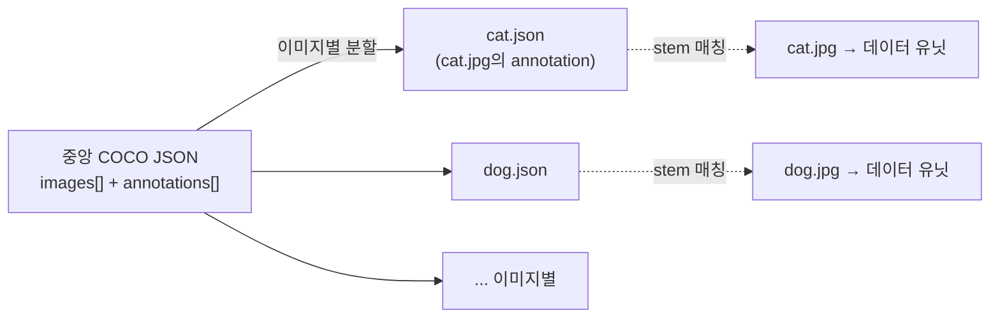
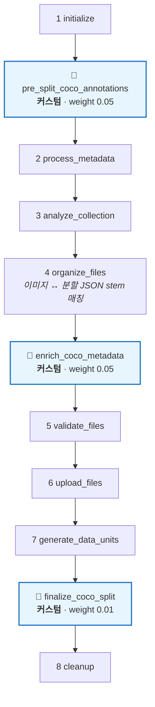
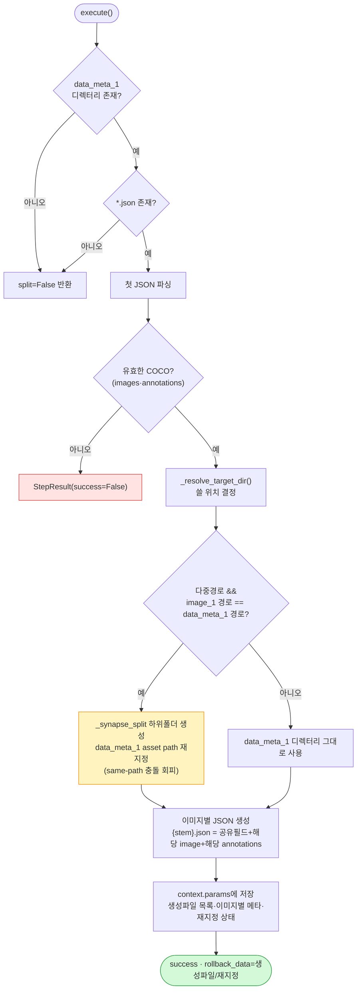
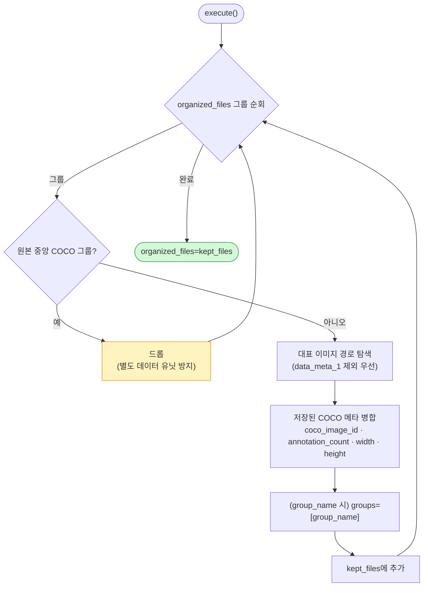

# centralized-format-uploader

하나의 중앙 집중형 **COCO** 어노테이션 JSON을 이미지별 JSON으로 분할하여, 각 이미지를 개별 데이터 유닛으로 업로드하는 업로드 플러그인.

---

## 1. 플러그인 식별 정보

| 항목 | 값 |
| --- | --- |
| 폴더명 / GitHub 저장소 | `centralized-format-uploader` |
| 코드명 (`config.yaml` → `code`) | `centralized-format-uploader` |
| 플러그인 이름 (`config.yaml` → `name`) | `centralized-format-uploader-v2` |
| 패키지명 (`pyproject.toml` → `name`) | `centralized-format-uploader` |
| 버전 | `2.2.0` |
| 카테고리 | `upload` |
| 지원 데이터 타입 | `image` |
| upload 진입점 | `plugin.upload.UploadAction` |

---

## 2. 개요

COCO 데이터셋은 보통 하나의 큰 JSON에 모든 이미지의 어노테이션이 모여 있습니다(**중앙 집중형**). 이 플러그인은 그 단일 COCO JSON을 **이미지 파일명(stem) 기준으로 분할**하여, 이미지 1장 = 데이터 유닛 1개로 업로드합니다.

핵심 설계 목표는 **어노테이션 스펙(`data_meta_1`)이 데이터 컬렉션에서 선택/필수 어느 쪽이든, 그리고 이미지와 JSON이 같은 경로를 쓰든 다른 경로를 쓰든 동작**하도록 하는 것입니다.

### 분할 개념도



---

## 3. 파라미터 (UI 스키마)

| 이름 | 형태 | 설명 | 기본값 |
| --- | --- | --- | --- |
| `group_name` | text | 데이터 유닛에 부여할 묶음 이름 | (없음) |

### 입력 요구사항

- `data_meta_1` 스펙 디렉터리에 유효한 COCO JSON(최소 `images`, `annotations` 키) 1개
- 이미지 파일명이 COCO의 `images[].file_name`과 일치해야 stem 매칭됨

---

## 4. 전체 업로드 워크플로우

기본 8단계 위에 **3개의 커스텀 단계**를 삽입합니다.



> 삽입 위치: `insert_before('organize_files', PreSplit…)`, `insert_after('organize_files', Enrich…)`, `insert_after('generate_data_units', Finalize…)`

---

## 5. 커스텀 단계 상세

### 5.1 `PreSplitCocoAnnotationsStep` — 분할 (organize_files 이전)

`organize_files`보다 **먼저** 실행되어야 이미지와 분할 JSON이 stem 기준으로 자연스럽게 짝지어집니다. `data_collection`이 없으면 스킵.



- 원본 COCO 파일은 **절대 덮어쓰지 않음**(출력 경로가 원본과 같으면 skip).
- 공유 필드로 `categories`, (있으면) `info`, `licenses`를 각 분할 JSON에 복사.
- **롤백**: 생성한 분할 JSON 삭제 + asset path 원복 + `_synapse_split` 폴더 제거.

> **same-path 충돌이란?** 다중 경로 모드에서 `image_1`과 `data_meta_1`이 동일 디렉터리를 가리키면, SDK의 `FlatFileDiscoveryStrategy`가 두 스펙을 구분하지 못해 모든 파일이 한 스펙으로 몰립니다. 이를 피하려고 분할 JSON을 `_synapse_split` 하위 폴더로 내려 디렉터리 깊이로 구분되게 합니다.

### 5.2 `EnrichCocoMetadataStep` — 메타 부착 (organize_files 직후)

이미 이미지-JSON 짝이 맞춰진 상태에서 메타데이터를 붙이고, 원본 중앙 COCO 그룹을 제거합니다.



### 5.3 `FinalizeCocoSplitStep` — 정리 (generate_data_units 직후)

업로드·데이터 유닛 생성이 **성공적으로 끝난 뒤** 임시 산출물을 정리합니다. 생성 파일도 재지정도 없으면 스킵.

- 분할 JSON 삭제 → `data_meta_1` asset path 원복 → `_synapse_split` 폴더 제거 → 관련 `context.params` 키 제거.
- 정상 경로는 이 단계가, **실패 경로는 `PreSplitCocoAnnotationsStep.rollback`** 이 정리를 담당(역할 분담).

---

## 6. 생성되는 메타데이터

| 키 | 설명 |
| --- | --- |
| `coco_image_id` | COCO image id |
| `coco_annotation_count` | 해당 이미지의 어노테이션 개수 |
| `coco_image_width` / `coco_image_height` | COCO 기록 이미지 크기 |
| `groups` | `group_name` 지정 시 (선택) |

---

## 7. 의존성

- `synapse-sdk`

---

## 8. 설치 / 실행 / 배포

```bash
uv sync
synapse run upload
synapse plugin publish
```
